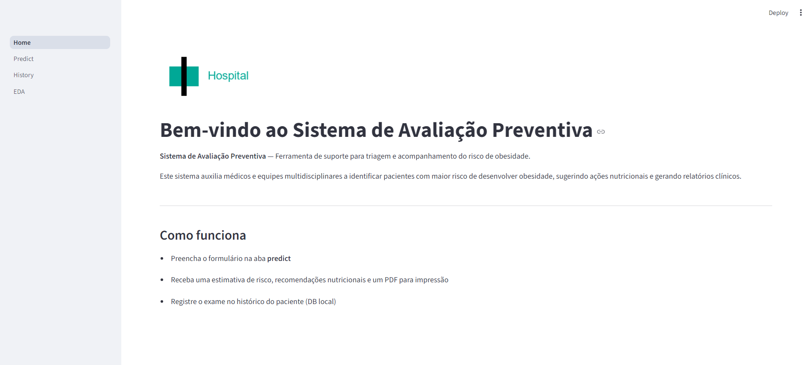
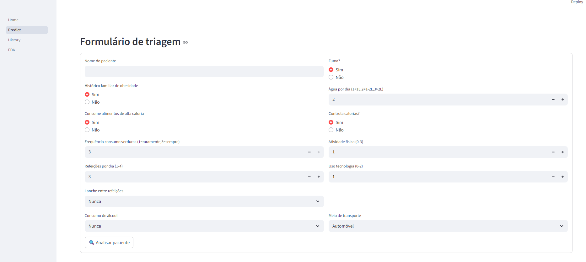
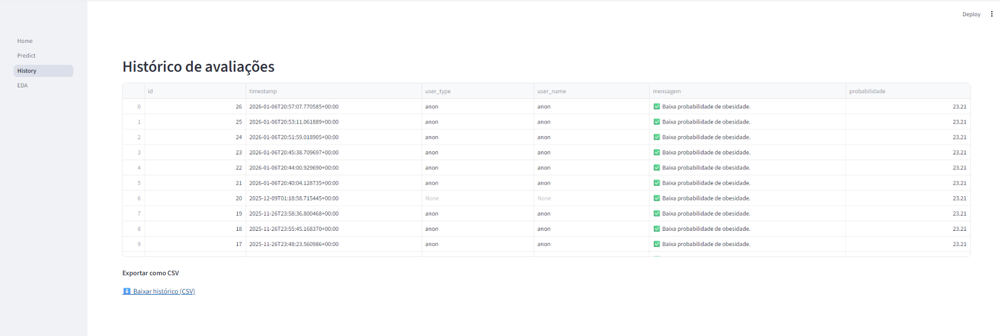
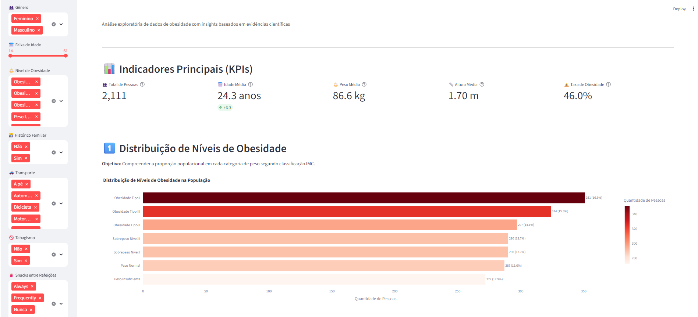

# Obesity Risk Prediction App

Machine Learning application for preventive obesity risk assessment, built with XGBoost and deployed through an interactive Streamlit interface.

The system enables healthcare professionals to evaluate patient risk, generate insights, and track historical data in a simple and intuitive workflow.

---

## Live Demo

https://oobesity-prediction.streamlit.app

---

## Application Preview

### Home



### Prediction (Triage Form)



### Patient History



### Dashboard (EDA)



---

## Business Value

* Early identification of obesity risk
* Support for clinical decision-making
* Automated risk assessment based on behavioral data
* Patient history tracking with persistent storage
* Data-driven insights through dashboards

---

## How to Run Locally

```bash
git clone https://github.com/luisparra0/obesity-prediction-app.git
cd obesity-prediction-app

python -m venv venv
venv\Scripts\activate

pip install -r requirements.txt

streamlit run app.py
```

---

## Application Structure

The application follows a multi-page Streamlit architecture:

```
pages/
├── 01_Home.py
├── 02_Prever.py
├── 03_Dashboard.py
├── 04_Historico.py
└── 05_Sobre.py
```

Pages are ordered using numeric prefixes to control navigation flow in the UI.

---

## Tech Stack

* Python
* Pandas
* NumPy
* Scikit-learn
* XGBoost
* Streamlit
* Matplotlib
* Seaborn
* SQLite

---

## Model

* Algorithm: XGBoost Classifier
* Task: Obesity Risk Classification
* Performance (Notebook):

  * Accuracy ≈ 96%
  * Cross-validation applied

---

## Features

* Interactive triage form
* Real-time ML predictions
* Risk visualization (charts)
* Exploratory data analysis (EDA)
* Patient history tracking (SQLite)
* CSV export functionality
* PDF report generation
* Clean and intuitive UI

---

## How It Works

1. The user fills in patient information in the Prever tab
2. The trained XGBoost model processes the input
3. A risk prediction is generated
4. The result is stored in a local SQLite database
5. Data can be explored through:

   * History tab
   * Dashboard (EDA)

---

## Notes

* The application uses a locally trained model (.joblib)
* Model evaluation and experimentation are available in the notebook (analytics.ipynb)
* Designed as an end-to-end ML application (data → model → product)

---

## Author

Luís Parra
Data Analyst focused on Machine Learning and Data Products
